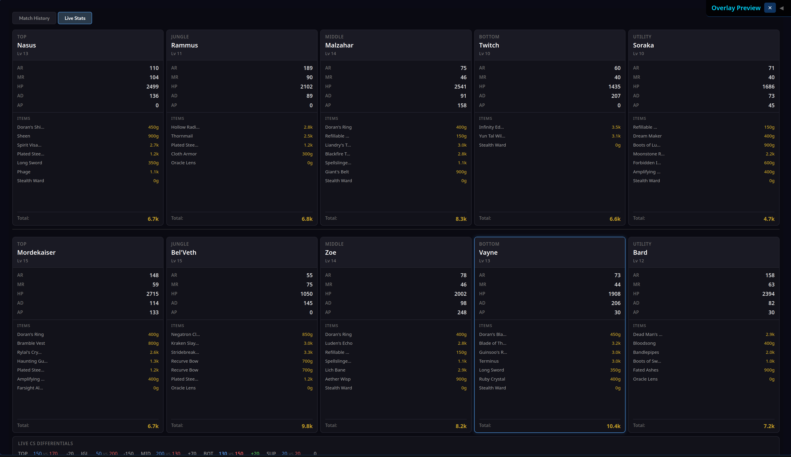
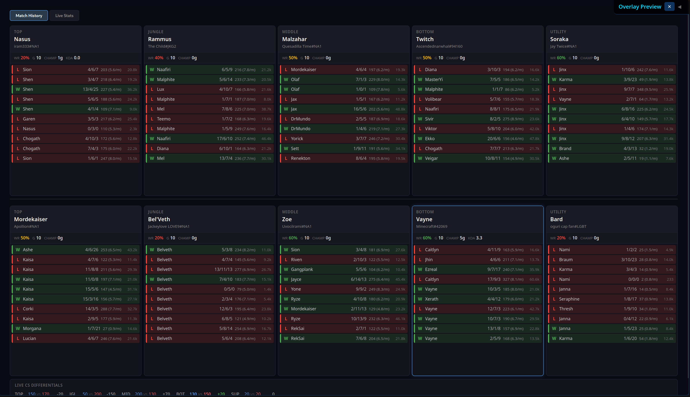

# League Match Companion

A desktop overlay for League of Legends that provides match context and personal performance tracking.

**Live Site:** https://gtrev500.github.io/league-match-companion/

## Features

- **Match History Lookup** - When your game starts, fetches recent ranked match data for all 10 players
- **Live Stats** - Real-time player statistics including items, gold, and CS differentials by lane
- **Performance Tracking** - Track your own CS differentials, damage output, and positioning patterns
- **Post-Game Analysis** - Item build timelines, gold progression, and heatmap visualization
- **Local Processing** - All data processed locally, nothing stored externally

## Tech Stack

- **Overwolf SDK** - Approved overlay platform for League of Legends
- **Riot Games API** - Official match data via ACCOUNT-V1 and MATCH-V5
- **Data Dragon** - Static champion and item data with local caching
- **Python Backend** - Secure server-side API key handling

## Screenshots

| Live Stats | Match History |
|------------|---------------|
|  |  |

## Status

In Development - Personal use tool for self-improvement.

## Legal

League Match Companion is not endorsed by Riot Games and does not reflect the views or opinions of Riot Games or anyone officially involved in producing or managing Riot Games properties. Riot Games and all associated properties are trademarks or registered trademarks of Riot Games, Inc.

## Contact

gabe@gtrev.dev
